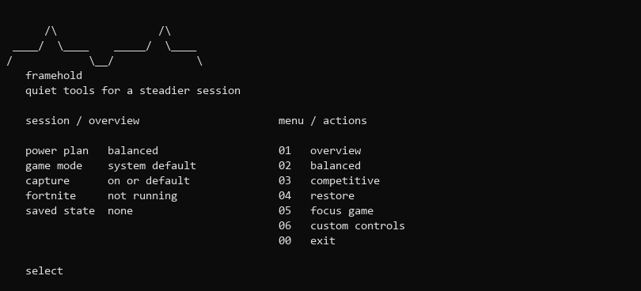

# framehold

quiet session controls for fortnite on windows.



framehold shows the current power plan, game mode, game process, and saved state in a small terminal interface. each change is previewed and the original values are saved for restore. fortnite's files and in-game settings, including render scale, are never edited.

## actions

| action | effect |
| --- | --- |
| `balanced` | enables game mode and disables background game capture for this account |
| `competitive` | applies balanced controls and activates high performance power; creates a temporary plan if needed |
| `custom controls` | choose any combination of game mode, capture, power, and per-app gpu preference |
| `focus game` | sets the current account's running fortnite process to above normal priority until it exits |
| `restore` | restores saved values and removes a temporary power plan; external changes are kept |

the gpu control uses windows' per-app graphics preference. launch fortnite first for automatic executable detection, or supply its full path. relaunch the game after changing that preference. windows and the graphics driver determine the actual gpu used. framehold does not install drivers or change boot settings.

## get started

download `framehold.exe` and its checksum from the [latest release](https://github.com/maximkochergin/framehold/releases/latest). verify the sha-256 before running the executable. it requests administrator rights; the app stops changes when elevation belongs to a different signed-in account. nuitka packaging does not digitally sign the file or guarantee a particular antivirus result.

open the executable for the menu, or use a direct action:

```text
framehold.exe --action status
framehold.exe --action restore
framehold.exe --action preview --preset competitive
framehold.exe --action apply --features capture,gpu --game-exe "c:\path\to\fortnitegame\binaries\win64\fortniteclient-win64-shipping.exe"
```

`competitive` may increase power use and heat. only one saved session can be active at a time. use `restore` to return to the saved values. snapshots are stored under `hklm\software\framehold\state` for the executing account. an incomplete restore keeps its snapshot for another attempt. framehold does not promise a fixed fps gain; compare the same scene before and after changing a control.

if an older version left `%localappdata%\fortnite-tweaker\snapshot.json`, restore it with the version that created it before using this release. framehold does not import that writable file.

## build from source

on windows, install python 3.14 and nuitka, then run `pwsh -file .\build.ps1 -python <path-to-python.exe>`. the script runs tests before building `dist\framehold.exe` and prints its sha-256. running `python framehold.py` from source is also supported.

framehold is an independent project and is not affiliated with epic games.

## references

controls are based on [epic's pc guidance](https://www.epicgames.com/help/c-34254770/c-38015632/a25544495), [microsoft's powercfg reference](https://learn.microsoft.com/en-us/windows-hardware/design/device-experiences/powercfg-command-line-options), and the [atlas game capture configuration](https://github.com/Atlas-OS/Atlas/blob/main/src/playbook/Configuration/tweaks/performance/disable-game-bar.yml). framehold implements a small, reversible subset.
