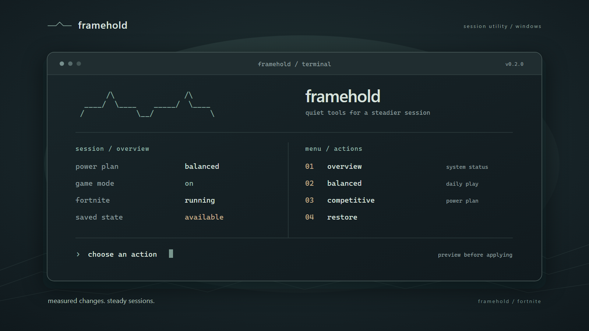

# framehold

спокойный терминальный инструмент для настройки игровой сессии fortnite на windows.

---

### идея

framehold собирает несколько понятных действий в одном интерфейсе: показывает состояние системы, даёт предварительно посмотреть изменения и помогает вернуться к сохранённым настройкам. инструмент рассчитан на аккуратную настройку, а не на обещания универсального прироста fps.

### возможности

| действие | что происходит |
| :--- | :--- |
| `overview` | показывает план питания, игровой режим windows, статус fortnite и сохранённых настроек |
| `balanced` | включает игровой режим, сохраняя текущий план питания |
| `competitive` | включает игровой режим и, если доступен, план высокой производительности |
| `focus game` | временно задаёт запущенной игре приоритет `above normal` |
| `restore` | возвращает сохранённые значения, учитывая изменения, сделанные вне инструмента |
| `in-game guide` | напоминает, какие параметры стоит проверить в самой игре |

перед применением профиля отображается список изменений. исходное состояние сохраняется до записи настроек; восстановление доступно из меню. приоритет процесса сбрасывается после закрытия игры.

### запуск

проект рассчитан на windows 10 и 11. готовая версия собирается в `framehold.exe` через nuitka и запрашивает права администратора при запуске. исходники можно запускать через python; для обычного использования установка python не нужна.

скачайте сборку из раздела releases репозитория, распакуйте архив и запустите `framehold.exe`. сверяйте sha-256 с опубликованной контрольной суммой перед подтверждением запроса windows. сборка через nuitka сама по себе не является цифровой подписью и не гарантирует отсутствие предупреждений защитного по.

для запуска исходников: `python framehold.py`. для самостоятельной сборки: `pwsh -file .\build.ps1 -python <путь-к-python.exe>`. нужен python 3.14 с nuitka 4.2.2; скрипт сборки запускает тесты и создаёт exe с запросом прав администратора.

### выбор профиля

`balanced` — отправная точка для повседневной игры, особенно на ноутбуке. `competitive` дополнительно переключает доступный план высокой производительности; это может увеличить расход энергии и нагрев. сравнивайте результат в одной и той же игровой сцене по счётчику кадров и ровности времени кадра.

framehold не редактирует файлы fortnite, не устанавливает драйверы и не меняет параметры загрузки windows. графику и режим рендеринга выбирают в самой игре; [рекомендации epic games по performance mode](https://www.epicgames.com/help/c-34254770/a26749910) помогут подобрать отправные настройки.

### сохранение настроек

снимок профиля хранится в `hklm\software\framehold\state` отдельно для каждой учётной записи. запись защищена стандартными правами реестра; два одновременно открытых экземпляра не могут применить профиль поверх одного снимка. при восстановлении framehold сохраняет настройки, которые были изменены вручную после применения профиля, а при неполном откате оставляет снимок для повторной попытки.

при первом восстановлении framehold также умеет прочитать снимок прежней версии из `%localappdata%\fortnite-tweaker\snapshot.json`. пока такой снимок не восстановлен, новый профиль не применяется. старый файл остаётся на диске как архив; после успешного импорта он больше не используется.

если windows запросит учётные данные другого администратора, инструмент остановит изменение настроек текущего пользователя: запускать его следует из собственной учётной записи администратора.

### версии

релизы получают теги `vmajor.minor.patch`: `major` — несовместимые изменения, `minor` — новые возможности, `patch` — исправления. история ниже фиксирует заметные для пользователя изменения.

#### v0.2.0 · 2026-09-25

- новое имя и графическое оформление framehold;
- переход на python и сборка отдельного исполняемого файла через nuitka;
- улучшения проверки состояния, применения профиля и восстановления настроек.

#### v0.1.0 · 2026-09-25

- первый терминальный интерфейс с двумя профилями и предварительным просмотром;
- сохранение и восстановление игрового режима и плана питания;
- обзор состояния, временный приоритет процесса и памятка по игре.

### примечания

framehold — независимый проект, не связанный с epic games. результат зависит от компьютера, настроек игры и фоновой нагрузки. некоторые действия могут быть ограничены политиками windows или защитой игрового процесса.
